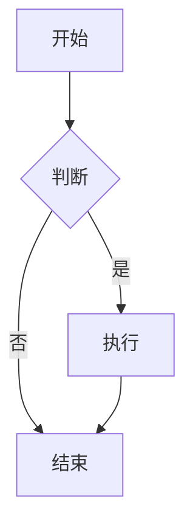
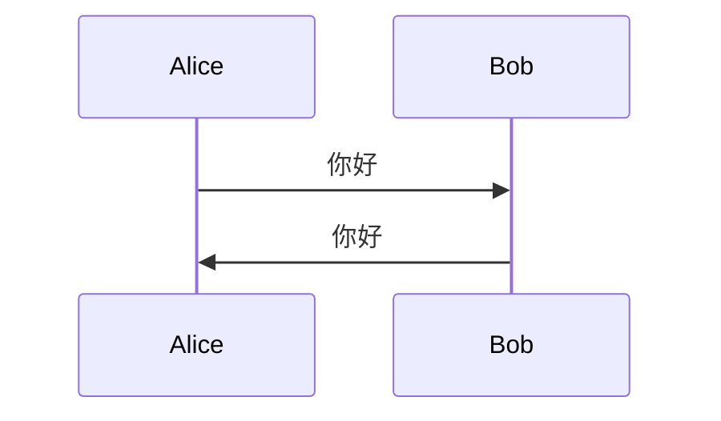

# 📝 富文本编辑器使用指南

## 功能概述

Love Journal 现在集成了强大的 **Vditor** 富文本编辑器，提供专业的 Markdown 写作体验。

### ✨ 主要特性

1. **三种编辑模式**
   - 所见即所得（WYSIWYG）- 类似 Word 的编辑体验
   - 即时渲染（IR）- 边写边看效果
   - 分屏预览（SV）- 左边编辑，右边预览

2. **丰富的格式支持**
   - 标题、段落、引用
   - 粗体、斜体、删除线
   - 有序列表、无序列表、任务列表
   - 代码块、行内代码
   - 表格、链接、图片
   - 数学公式（LaTeX）
   - 流程图、时序图

3. **图片上传**
   - 拖拽上传
   - 粘贴上传
   - 点击上传
   - 自动压缩和优化

4. **智能功能**
   - 自动保存（每 30 秒）
   - 字数统计
   - 快捷键支持
   - 表情符号
   - 目录生成

---

## 🚀 快速开始

### 创建新文章

#### 方法 1：使用富文本编辑器（推荐）

1. 进入「文章」页面
2. 点击「✨ 使用富文本编辑器」按钮
3. 开始写作

#### 方法 2：从后台管理

1. 进入「后台管理」→「文章管理」
2. 点击任意文章的「编辑器」按钮
3. 或创建新文章后点击「编辑器」

### 编辑现有文章

1. 进入「后台管理」→「文章管理」
2. 找到要编辑的文章
3. 点击「编辑器」按钮

---

## 📖 编辑器界面

### 顶部工具栏

```
[← 返回] [文章标题输入框]     [● 未保存] [⚙️ 设置] [💾 保存草稿] [🚀 发布]
```

- **返回按钮**：返回上一页（有未保存更改会提示）
- **标题输入框**：输入文章标题
- **保存状态**：显示保存状态（未保存/已保存）
- **设置按钮**：打开文章设置面板
- **保存草稿**：保存为草稿状态
- **发布按钮**：发布或更新文章

### 编辑器工具栏

Vditor 提供了丰富的工具栏按钮：

| 图标 | 功能 | 快捷键 |
|------|------|--------|
| 😊 | 插入表情 | - |
| H | 标题 | Ctrl+H |
| **B** | 粗体 | Ctrl+B |
| *I* | 斜体 | Ctrl+I |
| ~~S~~ | 删除线 | Ctrl+D |
| --- | 分隔线 | - |
| > | 引用 | Ctrl+Shift+Q |
| • | 无序列表 | Ctrl+L |
| 1. | 有序列表 | Ctrl+O |
| ☑ | 任务列表 | Ctrl+J |
| `<>` | 代码块 | Ctrl+U |
| `` | 行内代码 | Ctrl+G |
| 🔗 | 插入链接 | Ctrl+K |
| 📊 | 插入表格 | - |
| 📷 | 上传图片 | - |
| ↶ | 撤销 | Ctrl+Z |
| ↷ | 重做 | Ctrl+Y |
| 👁 | 预览 | - |
| ⛶ | 全屏 | - |

---

## 💡 使用技巧

### 1. Markdown 语法速查

#### 标题
```markdown
# 一级标题
## 二级标题
### 三级标题
```

#### 文本样式
```markdown
**粗体文本**
*斜体文本*
~~删除线~~
`行内代码`
```

#### 列表
```markdown
- 无序列表项 1
- 无序列表项 2

1. 有序列表项 1
2. 有序列表项 2

- [ ] 待办事项 1
- [x] 已完成事项 2
```

#### 引用
```markdown
> 这是一段引用文本
> 可以多行
```

#### 链接和图片
```markdown
[链接文本](https://example.com)

```

#### 代码块
````markdown
```python
def hello():
    print("Hello, World!")
```
````

#### 表格
```markdown
| 列1 | 列2 | 列3 |
|-----|-----|-----|
| 内容1 | 内容2 | 内容3 |
```

### 2. 图片上传

#### 方法 1：拖拽上传
直接将图片文件拖到编辑器中

#### 方法 2：粘贴上传
复制图片后，在编辑器中按 `Ctrl+V`

#### 方法 3：点击上传
点击工具栏的 📷 按钮，选择图片文件

#### 方法 4：Markdown 语法
```markdown

```

### 3. 快捷键

| 功能 | Windows/Linux | Mac |
|------|---------------|-----|
| 保存 | Ctrl+S | Cmd+S |
| 粗体 | Ctrl+B | Cmd+B |
| 斜体 | Ctrl+I | Cmd+I |
| 链接 | Ctrl+K | Cmd+K |
| 撤销 | Ctrl+Z | Cmd+Z |
| 重做 | Ctrl+Y | Cmd+Y |
| 全屏 | F11 | - |

### 4. 自动保存

- 编辑器会每 **30 秒**自动保存草稿
- 顶部会显示保存状态
- 手动保存：点击「保存草稿」或按 `Ctrl+S`

### 5. 编辑器模式切换

在「设置」面板中可以切换编辑器模式：

- **所见即所得**：适合不熟悉 Markdown 的用户
- **即时渲染**：边写边看，适合熟悉 Markdown 的用户
- **分屏预览**：左边编辑，右边预览，适合长文写作

---

## ⚙️ 文章设置

点击顶部的「⚙️ 设置」按钮，可以配置：

### 基本信息
- **摘要**：文章摘要，用于列表展示
- **封面图片**：文章封面
- **标签**：文章标签，用逗号分隔

### 可见性控制
- 🌍 **公开**：所有人可见
- 👥 **访客可见**：需要登录
- 💑 **仅两人可见**：只有情侣双方可见
- 🔒 **私有**：仅作者可见
- 🔐 **密码保护**：需要密码才能查看

### 发布状态
- **草稿**：未发布，仅自己可见
- **已发布**：根据可见性设置对外展示

### 协作设置
- **允许另一半编辑**：勾选后，伴侣也可以编辑此文章

---

## 🎨 高级功能

### 1. 数学公式

使用 LaTeX 语法插入数学公式：

#### 行内公式
```markdown
这是一个行内公式：$E = mc^2$
```

#### 块级公式
```markdown
$$
\frac{-b \pm \sqrt{b^2 - 4ac}}{2a}
$$
```

### 2. 流程图

使用 Mermaid 语法绘制流程图：

````markdown

````

### 3. 时序图

````markdown

````

### 4. 任务列表

```markdown
- [x] 完成的任务
- [ ] 待完成的任务
- [ ] 另一个待完成的任务
```

### 5. 表格对齐

```markdown
| 左对齐 | 居中对齐 | 右对齐 |
|:-------|:--------:|-------:|
| 内容1  | 内容2    | 内容3  |
```

---

## 🔧 常见问题

### Q: 如何切换回旧的编辑方式？

A: 在文章列表页面，仍然可以使用简单的文本框创建文章。富文本编辑器是可选的。

### Q: 旧文章能用富文本编辑器编辑吗？

A: 可以！系统会自动将旧的 blocks 格式转换为 Markdown。

### Q: 图片上传失败怎么办？

A: 检查：
1. 图片大小是否超过限制（默认 10MB）
2. 图片格式是否支持（JPG、PNG、GIF、WebP）
3. 是否已登录

### Q: 自动保存的内容在哪里？

A: 自动保存会更新文章的草稿状态，可以在「文章管理」中查看。

### Q: 如何导出文章？

A: 可以：
1. 复制编辑器中的 Markdown 内容
2. 使用后台的「导出备份」功能导出所有数据

### Q: 支持离线编辑吗？

A: 目前不支持离线编辑，需要网络连接。

---

## 📚 最佳实践

### 1. 文章结构

建议的文章结构：

```markdown
# 文章标题

> 一段引人入胜的引言或摘要

## 第一部分

正文内容...

### 小节标题

详细内容...

## 第二部分

更多内容...

## 总结

总结性文字...
```

### 2. 图片使用

- 使用有意义的图片描述
- 控制图片大小，避免过大
- 重要图片建议本地上传，不要使用外链

### 3. 标签使用

- 使用简短、有意义的标签
- 每篇文章 3-5 个标签为宜
- 标签用逗号分隔：`旅行, 美食, 回忆`

### 4. 定期备份

- 使用后台的「导出备份」功能
- 重要文章建议本地保存一份 Markdown 源文件

---

## 🎯 快捷操作

### 创建文章的完整流程

1. 点击「✨ 使用富文本编辑器」
2. 输入标题
3. 在编辑器中写作
4. 点击「⚙️ 设置」配置文章属性
5. 点击「🚀 发布」或「💾 保存草稿」

### 编辑文章的完整流程

1. 在「文章管理」中找到文章
2. 点击「编辑器」按钮
3. 修改内容
4. 点击「🚀 更新」保存

---

## 💬 反馈与支持

如果在使用过程中遇到问题或有改进建议，欢迎：

1. 查看项目 GitHub Issues
2. 联系开发团队
3. 查看 Vditor 官方文档：https://b3log.org/vditor/

---

**祝你写作愉快！✍️💕**
